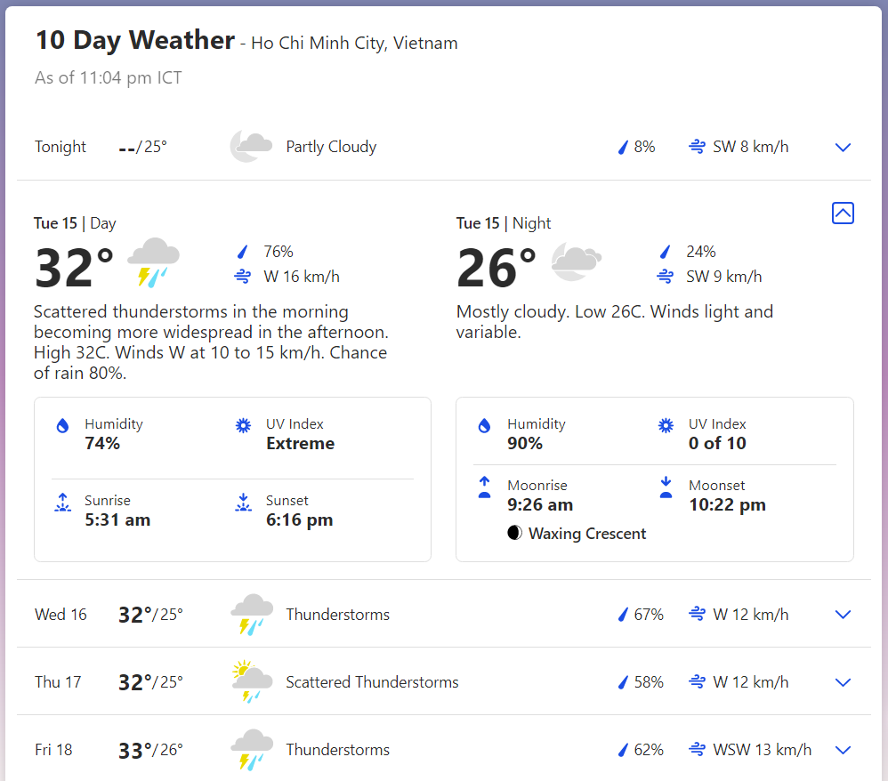
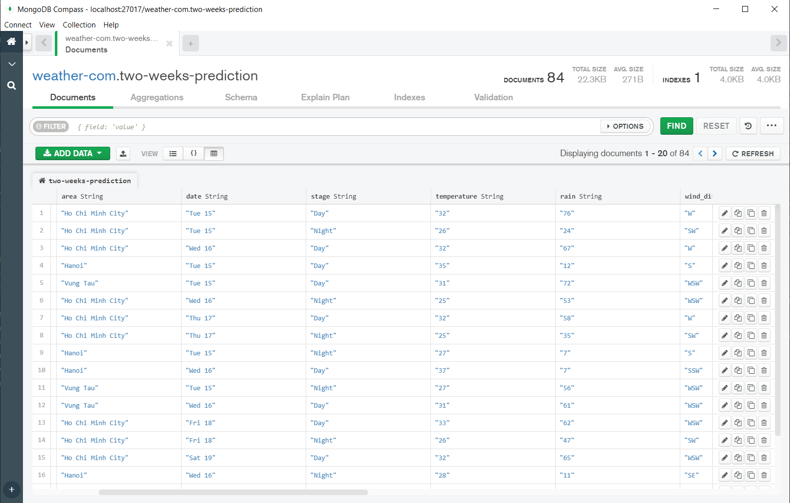
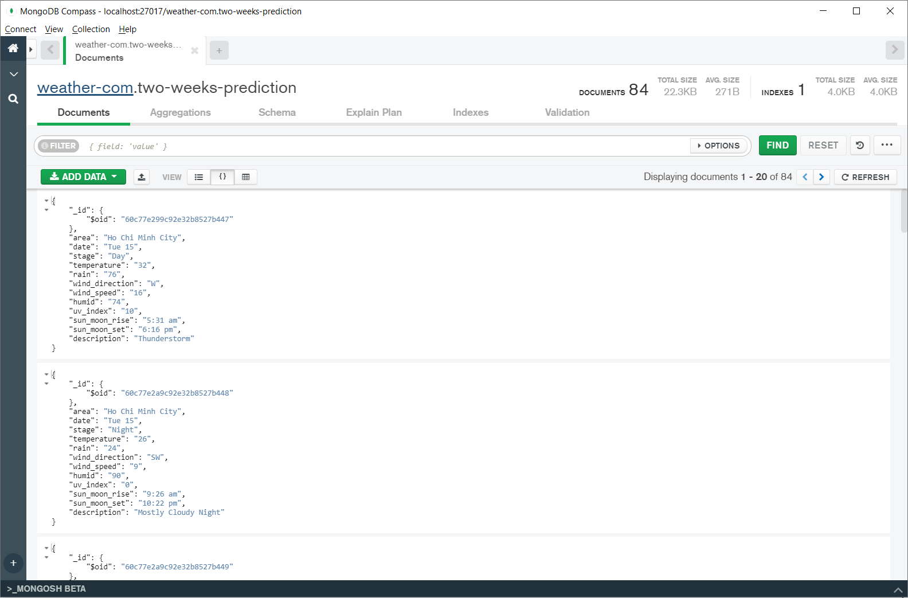

# simple-web-crawler

#### This is report about what I did in the previous week.


## 1. Tasks:

Build a simple web crawler and store results in MongoDB.

Keywords: **Celery**, **Debezium**, **NoSQL**

## 2. Solution:

After watching and reading some tutorial, I have chosen **Scrapy framework** as my tool to crawl, because it is open-source, so all the tool to crawl or process the data is provided, what I needed to do is only config and custom as my demand. And 2 website that I try to crawl this time is:

* https://stackoverflow.com/
* https://weather.com/

### Specify data

At first, I choose **stack overflow** and newest questions page as I want to try with simple and small amount of data.


3 fields that I will try to crawl here is **title**, **url**, **author** (*url* is the link to the question). For example, as the image above I will have first element in JSON as:

```json
{
	"title": "Sorting list in list", 
	"url": "/questions/67968415/sorting-list-in-list", 
	"author": "dedgor"
}
```

The [items.py](./stack/stack/items.py) is used to define storage “containers” for the data that we plan to scrape.

```python
class StackItem(scrapy.Item):
    title = Field()
    url = Field()
    author = Field()
```


### Create the spider

Here, I defined a class that inherits from Scrapy's Spider and adding attribute as needed, this is specific to each individual web page [weather_spider.py](./weather/weather/spiders/weather_spider.py).

```python
class StackSpider(Spider):
    name = "stack"
    allowed_domains = ["stackoverflow.com"]
    start_urls = [
        "http://stackoverflow.com/questions?pagesize=50&sort=newest",
    ]
```

The three variables are:

* `name`: defines the name of the Spider.
* `allowed_domains`: contains the base-URLs for the allowed domains for the spider to crawl.
* `start_urls`: is a list of URLs for the spider to start crawling from.

Scrapy uses XPath selectors as one in many ways to extract data from a website. And I can find a specific Xpath using Chrome’s Developer Tools. As I understand, Xpath can be expressed like this:

* Xpath: `//div[@class="summary"]/h3` 

* Means: **Grab all `<h3>` elements that are children of a `<div>` that has a class of `summary`**.


So I updated the spider class as below:

```python
def parse(self, response):
    questions = Selector(response).xpath('//div[@class="summary"]')

    for question in questions:
        item = items.StackItem()
        item['title'] = question.xpath(
            'h3/a[@class="question-hyperlink"]/text()').extract()[0]
        item['url'] = question.xpath(
            'h3/a[@class="question-hyperlink"]/@href').extract()[0]
        item['author'] = question.xpath('.//div[@class="user-details"]/a/text()').extract()[0]
        yield item
```

I can render the output to a JSON or CSV file with this command:

```shell
$ scrapy crawl stack -o items.json
$ scrapy crawl stack -o items.csv
```
And got the result below:


### The same with weather.com

The page I use as the start url is about *"10 days weather prediction in Ho Chi Minh City, Vietnam"*, but actually it's 14 days.



Here, I feel there are more things to consider rather than the previous page I crawled:

1. It divides into 2 stages of day **Day** and **Night**, with Day it includes **Sunrise** and **Sunset**, Night includes **Moonrise** and **Moonset**. If I separate these two, it will appears a lot Null value, hard to model.
2. If I want to crawl at many places in Viet Nam, should I use 1 table for each place or many.

But after all, I decide to include all of it into 1 table with structure as below [items.py](./weather/weather/items.py) :

```python
class Weather(scrapy.Item):
    area = Field() 		# Specify the place of weather station
    date = Field() 		# Prediction date
    stage = Field() 		# Day / Night
    temperature = Field()
    rain = Field() 		# (%)
    wind_direction = Field()
    wind_speed = Field()	# (km/h)
    humid = Field() 		# (%)
    uv_index = Field() 		# in the scale of [0, 10]
    sun_moon_rise = Field() 	# sun if (stage == 'Day') else moon
    sun_moon_set = Field() 	# sun if (stage == 'Day') else moon
    description = Field()
```

* ***If you have any suggestion about this, I would like to hear.***

With this page I want to crawl multiple page so I add 3 places **Ho Chi Minh City**,  **Hanoi**, **Vung Tau** respectively in `start_url` list. [weather_spider.py](./weather/weather/spiders/items.py)

```python
class WeatherSpider(Spider):
    name = "weather"
    allowed_domains = ["weather.com"]
    start_urls = [
     "https://weather.com/weather/tenday/l/e4f3028ded4eaa85aa504baa51acd7b6df7932ebc68c9d7aff1c838d1178f42c?unit=m",
     "https://weather.com/weather/tenday/l/e09d58707a823303a77d65888f867fbe34d5d80ab1e7983a17461491a84474eb?unit=m",
     "https://weather.com/weather/tenday/l/4146b4883b552478c73917248dea524b38432dceb4f7bda8f5bc980ddf58b97b?unit=m",    
    ]
```
Here is how I extract data from XPath:
```python
def parse(self, response):
    informations = Selector(response).xpath('//div[@class="DaypartDetails--Content--XQooU DaypartDetails--contentGrid--3cYKg"]')
    area = Selector(response).xpath('//span[@data-testid="PresentationName"]/text()').extract()[0]
    for detail in informations[1:]:
        day = items.Day()
        day['area'] = area.split(',')[0]
        day['date'] = detail.xpath('.//h3/span/text()').extract()[0]
        day['stage'] = detail.xpath('.//h3/text()').extract()[0][3:]
        day['temperature'] = detail.xpath('.//div/span[@data-testid="TemperatureValue"]/text()').extract()[0][:-1]
        day['rain'] = detail.xpath('.//div[@class="DailyContent--label--3rOJ4"]/span[@data-testid="PercentageValue"]/text()').extract()[0][:-1]
        day['wind_direction'] = detail.xpath('.//span[@data-testid="Wind"]/text()').extract()[0][:-1]
        day['wind_speed'] = detail.xpath('.//span[@data-testid="Wind"]/text()').extract()[1][:-5]
        day['humid'] = detail.xpath('.//div[@class="DetailsTable--field--2T9Jw"]/span[@data-testid="PercentageValue"]/text()').extract()[0][:-1]
        uv = detail.xpath('.//span[@data-testid="UVIndexValue"]/text()').extract()[0]
        day['uv_index'] = uv[:-6] if uv != 'Extreme' else '10'
        day['sun_moon_rise'] = detail.xpath('.//span[@data-testid="SunriseTime"]/text()').extract()[0]
        day['sun_moon_set'] = detail.xpath('.//span[@data-testid="SunsetTime"]/text()').extract()[0]
        day['description'] = detail.xpath('.//div[@data-testid="weatherIcon"]/svg/title/text()').extract()[0]


        night = items.Night()
        night['area'] = area.split(',')[0]
        night['date'] = detail.xpath('.//h3/span/text()').extract()[1]
        night['stage'] = detail.xpath('.//h3/text()').extract()[1][3:]
        night['temperature'] = detail.xpath('.//div/span[@data-testid="TemperatureValue"]/text()').extract()[1][:-1]
        night['rain'] = detail.xpath('.//div[@class="DailyContent--label--3rOJ4"]/span[@data-testid="PercentageValue"]/text()').extract()[1][:-1]
        night['wind_direction'] = detail.xpath('.//span[@data-testid="Wind"]/text()').extract()[2][:-1]
        night['wind_speed'] = detail.xpath('.//span[@data-testid="Wind"]/text()').extract()[3][:-5]
        night['humid'] = detail.xpath('.//div[@class="DetailsTable--field--2T9Jw"]/span[@data-testid="PercentageValue"]/text()').extract()[1][:-1]
        night['uv_index'] = '0'
        night['sun_moon_rise'] = detail.xpath('.//span[@data-testid="MoonriseTime"]/text()').extract()[0]
        night['sun_moon_set'] = detail.xpath('.//span[@data-testid="MoonsetTime"]/text()').extract()[0]
        night['description'] = detail.xpath('.//div[@data-testid="weatherIcon"]/svg/title/text()').extract()[1]

        yield day
        yield night
```


### MongoDB

I have also learn about MongoDB and how to interact with it. In this crawler, I used **PyMongo** to insert the data directly after extract, not through JSON file. 

First is assign database infomation in [settings.py](./weather/weather/settings.py):

```python
ITEM_PIPELINES = {'weather.pipelines.WeatherPipeline':1}

MONGODB_SERVER = "localhost"
MONGODB_PORT = 27017
MONGODB_DB = "weather-com"
MONGODB_COLLECTION = "two-weeks-prediction"
```

Then, config `WeatherPipeline` class in [pipelines.py](./weather/weather/pipelines.py)

```python
class WeatherPipeline:
    def __init__(self):
        connection = pymongo.MongoClient(
            settings.MONGODB_SERVER,
            settings.MONGODB_PORT
        )
        db = connection[settings.MONGODB_DB]
        self.collection = db[settings.MONGODB_COLLECTION]
        
    def process_item(self, item, spider):
        self.collection.insert(dict(item))
        return items
```

After run the command:

```shell
$ scrapy crawl weather
```

I got this, and it is the same with current data on [weather.com](https://weather.com/).






## 3. Other things

* I also learn a little bit about **Celery**, try on some simple functions but have not applied on Crawler. I will try it this week. 

  But one thing I have read in the Celery documentation. It said *"Celery requires a solution to send and receive messages; usually this comes in the form of a separate service called a message broker."* And here are the **Brokers**, which it lists out.

| **Name**     | **Status**   | **Monitoring** | **Remote Control** |
| ------------ | ------------ | -------------- | ------------------ |
| *RabbitMQ*   | Stable       | Yes            | Yes                |
| *Redis*      | Stable       | Yes            | Yes                |
| *Amazon SQS* | Stable       | No             | No                 |
| *Zookeeper*  | Experimental | No             | No                 |

  The thing I feel a bit cofused here is in the *'System Design'* that I saw, we use **Kafka MQ** which I think is the same type as the list above. So I want to ask that, the **Kafka MQ** will provide other functionality rather than those 4 or I misunderstand something here.

* About **Debezium**, I have read about it but not too detail, so I don't really understand how it work in this system. I think I need more time to read carefully about it.

## 4. My own tasks for this week
* Crawl on the given website.
* Design a system crawling multiple page on one website in more efficient way.
* Try applying Celery on crawler.
* Read more about Celery, Debezium, Kafka.
* Prepare for the presentation.

### If you want to test my result, you can do as following

1. Activate virtual environment (for Windows)
```shell
Set-ExecutionPolicy -Scope Process -ExecutionPolicy Bypass
.\venv\Scripts\activate
```

2. Move to crawler and run crawl command

```shell
cd .\weather
scrapy crawl stack -o items.json
scrapy crawl stack -o items.csv
```

